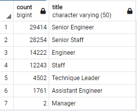
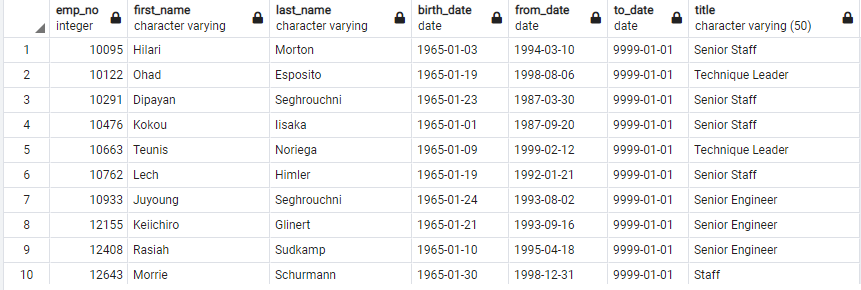
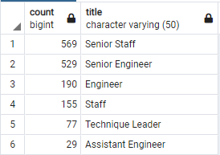
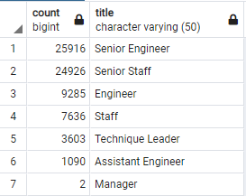

# Pewlett Hackard Retirement Analysis

## Overview of Project:

Using SQL to perform an analysis of employee data for Pewlett Hackard.  Employee data was reviewed to determine employee retirement eligibility numbers.  The information is then further broken down to determine role/title impact as well as mentorship opportunities to mitigate impact of large retirement volumes occurring in a short period of time.

### Purpose:

SQL was used to perform an analysis of Pewlett Hackard's employee data to determine upcoming retirement eligibility numbers.  Two primary tasks were given: 1) Determine the number of employees retiring based on title; 2) Identify employees who are eligible to participate in a mentorship program in response to the number of upcoming retirements dubbed the "silver tsunami".  

## Analysis Results and Challenges:

### Analysis of Outcomes 

For task #1, the Unique Titles summary table outlines the number of projected retirees broken down by title.  This breakdown allows us to see which title levels are more heavily impacted.

#### Unique Titles Summary Count Table

    
For task #2, the Mentorship Eligibility table outlines the list of employees that are eligible to participate in a mentorship program.  The summary table includes current employees providing their name, birth date, and current title.  The mentorship eligibility query is focused on individuals born in 1965.

#### Mentorship Eligibility Table Exerpt

Based on the two tables, the following conclusions can be made:

-- From a total company employee count of 300,024, there are 90,398 employees eligible for retirement or approximately 30% of the company.  The large number of potential retirees is being dubbed the "silver tsunami".  Because the birth date range of 1952-1955 is being used to determine the number of retirement eligible employees, it is difficult to know the upcoming year to year forecast of employees retiring from the company but there is potential for very large numbers within the next few years.

-- Of the over 90,000 retirement eligible employees, approximately 64% (57,668 employees) have senior management titles.  The largest portion being Senior Engineers (29,414 employees) with the second largest title group from Senior Staff (28,254 employees).

-- The lowest number of retirement eligible employees have a Manager title (2 employees).  Based on this breakdown, technical knowledge/expertise within the company would be the largest impact/risk versus employee management/supervision skills.

-- When looking at mentorship eligibility, of current employees born in 1965, there are 1549 eligible employees.  

-- When mentorship eligibility is focused on current employees born in 1965, a relatively small number of eligible employees is returned compared to the overall number of employees eligible for retirement.  More detailed and broader mentorship or succession planning is required that not only looks as employee birth dates but also skill, experience, and employee ambitions.  As well as looking at overall organizational structure and strategies such as job consolidation, automation, and out-sourcing certain activities.

### Challenges and Difficulties Encountered

No challenges were encountered during the analysis. But assumptions or additional actions taken include:

* For the mentorship_eligibility table, the query included ordering the title "to_date" to ensure the current title was pulled for the current employees.  By including this additional ordering parameter, the result was a minor difference with the verification image for employee 10291 where the current title for this employee is Senior Staff instead of Staff.  But this additional ordering parameter does not change the overall number of mentorship eligible employees born in 1965.

## Summary

There are seven roles that have retirement eligible employees identified.  The roles include, from highest number of employees to least, Senior Engineer, Senior Staff, Engineer, Staff, Technique Leader, Assistant Engineer, and Manager.  Based on the summary counts alone, it appears that the Senior Engineer and Senior Staff roles will feel the greatest impact.

Based on a birth year of 1965 for current employees, there are 1549 employees that are eligible for mentorship opportunities.  This is not enough to mentor the next generation of Pewlett Hackard employees if a total of 90,398 are eligible for retirement.  If consideration for mentorship eligibility was opened to more than the current employees born in 1965 and if additional focus on mitigating impact to particular roles or job duties first, rather than tackling all the roles impacted at once, could be better options to start.  Also considering retirement eligible employees to provide mentorship or transition plans before they retire can help prepare the next generation of Pewlett Hackard employees.

To provide more information to address the "silver tsunami", the following additional queries were executed:

1) Summary count breakdown by Title (e.g. role) for employees born in 1965 identified to be eligible for a mentorship opportunity.  By providing the role breakdown count, we are able to see if there are enough mentor eligible employees for each of the retirement impacted roles described above.  As noted above, the 1549 employees eligible for mentorship opportunities is not enough.  This gap is further exemplified if focused on the highest retirement eligible role of Senior Engineer.  Per the mentorship summary below, if mentorship was needed to cover all the vacancies created from employee retirement, each of the 529 Senior Engineer eligible mentors would need to mentor at least 55 employees to cover the 29,414 retirement eligible employees.  Mentoring that many employees would not leave enough time for them to complete any other job duties besides mentoring.

#### Mentorship Count Summary of Current Employees

2) Query to determine the number of retirement eligible employees updated to take current employee status into account and not only employee birth dates.  By updating the query to determine the count of employees eligible for retirement to take current employee status into account, the total number was reduced from over 90,000 to approximately 72,400.  Although the number is still large, adjusting the query to take current employee status into account ensures more accurate analysis of retirement impact and impacted roles.
 
#### Retirement Eligibility Table of Current Employees

